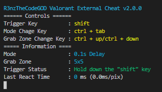

# R3nzTheCodeGOD Valorant External Cheat
- **Status:** `UNDEDECTED`
- **When you take your crosshair to the man, it shoots at the enemy in 5ms.**

## Download and Using 

### I suggest
- download code `git clone https://github.com/R3nzTheCodeGOD/Valorant-External-Cheat.git`
- Install libraries with `pip install -U -r requirements.txt`
- first open the console then run the code with `py main.py`
- **NOTE:**  You need python 3 on your computer for this method

### second method / easy but I don't recommend
- download the latest version [here](https://github.com/R3nzTheCodeGOD/Valorant-External-Cheat/releases)
- run `R3nzVal.exe`

## Game Settings and Note
- **You have to play the game in `purple colorblind mode`**
- **if it doesn't work in fullscreen try it in fullscreen windowed mode**

## Ban Risk
- 6 months no one has been banned by this cheat

## Keybinds
- The cheat works as long as you hold down the `Shift` key
- `ctrl + tab` to switch mode
- `ctrl + down` to decrease `ctrl + up` to increase the trigger area

## Changelog
### Version v2.0.2
- 1ms performance boost
- Purple color update
- 2 new mode
### Version v2.0.1
- Keyboard input lag issue fixed
- New sha256 hash system
### Version v2.0.0
- Increased performance, faster reaction time.
- Higher Security
- Added Full-Auto Mode.
- Holding down operating mode added continuous operation removed.
- Bunny hop was removed because it negatively affected the performance. Will be added later
- The program has been switched to the English language.

## Images from the program

