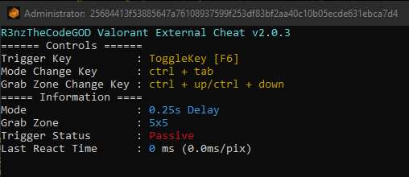

    
     
    <i>R3nzTheCodeGOD Valorant External Cheat</i>

    

# **R3nzTheCodeGOD Valorant External Cheat**
- **Status:** `DEDECTED`
- **The Cheat that hits the opponents approaching the barrel in an average of 5ms.**

## **Download and Using** 

### I suggest
- download code `git clone https://github.com/R3nzTheCodeGOD/Valorant-External-Cheat.git`
- Install libraries with `pip install -U -r requirements.txt`
- first open the console then run the code with `py main.py`
- **NOTE:**  You need python 3 on your computer for this method

### second method / easy but I don't recommend
- download the latest version [here](https://github.com/R3nzTheCodeGOD/Valorant-External-Cheat/releases)
- run `R3nzVal.exe`

## **Game Settings and Note**
- **You have to play the game in `purple colorblind mode`**
- **if it doesn't work in fullscreen try it in fullscreen windowed mode**

## **Keybinds and Config**

### Config
- To change the cheat settings, make changes to the `config.json` file that occurs after opening the cheat.
- `"IsHoldKey"`: Will the cheat work in `Hold Key` mode or `Toggle Key` mode?
- `"HoldKey"`  : `Hold Key` name to use
- `"ToggleKey"`: `Toggle Key` name to use

### Default Keybinds
- The cheat comes in `Toggle Key` mode by default and can be turned on or off with the `F6` key.
- `ctrl + tab` to switch mode
- `ctrl + down` to decrease `ctrl + up` to increase the trigger area

## **Changelog**

### Version v2.0.3
- New Config System
- Added HoldKey and ToggleKey mode

### Version v2.0.2
- 1ms performance boost
- Purple color update
- 2 new mode

### Version v2.0.1
- Keyboard input lag issue fixed
- New sha256 hash system

### Version v2.0.0
- Increased performance, faster reaction time.
- Higher Security
- Added Full-Auto Mode.
- Holding down operating mode added continuous operation removed.
- Bunny hop was removed because it negatively affected the performance. Will be added later
- The program has been switched to the English language.
